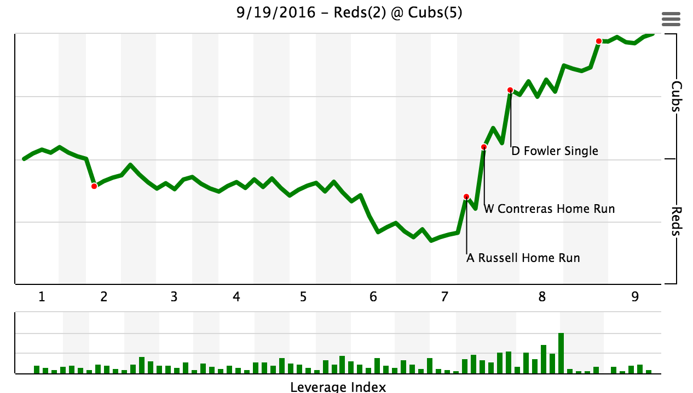
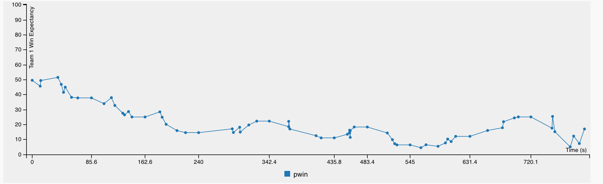
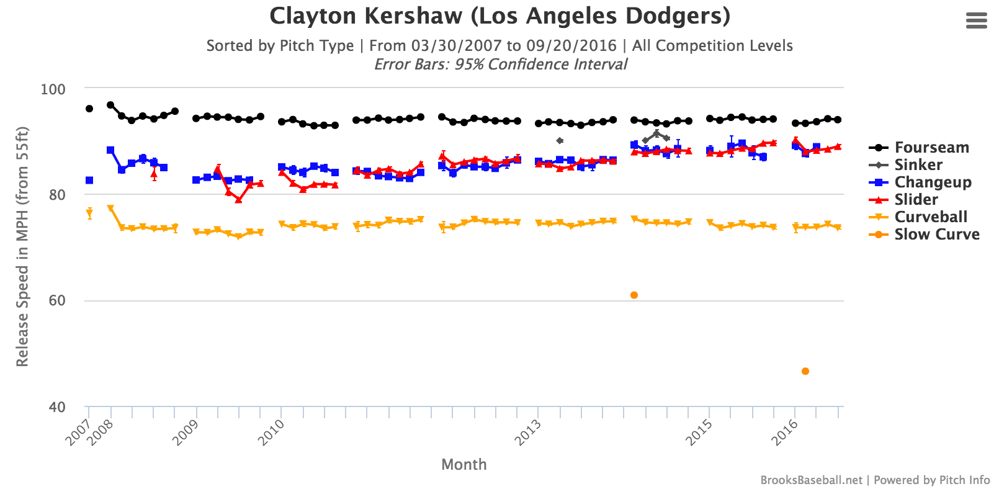
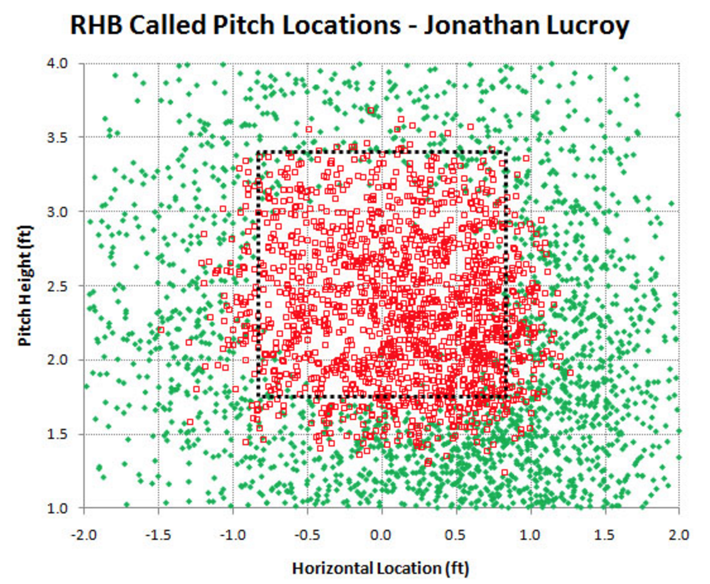

## Sabermetrics

### or Moneyball, a History

_Jon Eisen_

Nerd Night, Powder Keg Brewing

Sept 20, 2016

http://joneisen.me/r/sabremetrics

-----

## Introduction

I work for Activision on Call of Duty eSports data and analytics.

I've been interested in Sabermetrics for many years.


-----

## Contents

- Introduction and Early History
- Bill James
- Moneyball, Briefly
- DIPS and Voros McCracken
- The Book
- WAR
- Now and beyond: Data Explosion

-----

# Introduction and Early History

>>>>>

## A Definition

> The search for objective knowledge about baseball

_Bill James_, 1980

>>>>>

## An Etymology

*Society For American Baseball Research*

aka **SABR**, established 1971

Bill James coined the term Sabermetrics as a nod to SABR.

>>>>>

## 1850 to 1980

- 1850s: [Henry Chadwick](http://sabr.org/bioproj/person/436e570c) develops Box Score
    - Batting Average (BA) and Slugging Percentage (SLG) follow
- 1925: [F.C. Lane](http://sabr.org/research/henry-chadwick-award-fc-lane) publishes _Batting_
    - Opines that BA is misleading, singles are worth less than home runs
- 1940s: Dodgers GM [Branch Rickey](https://en.wikipedia.org/wiki/Branch_Rickey) hires statistician [Allan Roth](http://sabr.org/bioproj/person/350155ef)
- 1960s: Orioles Manager [Earl Weaver](http://sabr.org/latest/memoriam-stan-musial-and-earl-weaver) optimizes strategy

Note:

- Chadwick developed charting too
- FC Lane produced first linear weightings
- Allan Roth first statistician hired
- Earl Weaver first use of stats on field, index cards

-----

# Bill James

>>>>>

## Bill James, Annoyed

Annoyed at the lack of objective analysis in commentary.

- Wins credit solely to pitchers
- Inherent ballpark effects
- Errors: judged by a scorer

>>>>>

## Bill James Baseball Abstract

Annual publication, first published 1977.

- Articles wouldn't be published by other outlets
- By 1982, his work won respect and was republished
- Ended publication in 1988 due to burnout
- Published 4 Historical Abstracts

>>>>>

## Bill James' Influential Work

- Runs Created
- Pythagorean Winning Percentage
- Similarity Scores
- Hall of Fame monitor
- Game Scores

>>>>>

## Bill James, 2000 and beyond

- Named one of Time's 100 most influential people
- Hired by John Henry and Red Sox in 2003, who won 3 World Series since
- Directly inspired Billy Beane, and _Moneyball_


Still publishes on [billjamesonline.com](http://www.billjamesonline.com/)

-----

# Moneyball, Briefly

- Sandy Alderson, GM of Athletics 1983-1997, reads Bill James
- Alderson teaches Billy Beane about Bill James' work
- Billy Beane focuses on On-Base Percentage (OBP) to value hitters
- Athletics, despite low payroll, do well
- Michael Lewis, Aaron Sorkin do rest

Note:

Beane undervalued defense, which annoyed scouts

-----

# DIPS and Voros McCracken

**Defense Independent Pitching Statistics**

>>>>>

## What is DIPS?

> How much control, if any, does a pitcher have over whether a batted ball in play falls in for a hit?

- Wins and Losses blame a pitcher for outcomes like hits, errors, and fielded outs
- ERA is based on Earned Runs, based on Errors, which are subjective
- But what if in-play ball outcomes are the result of luck?

_Voros McCracken_, 1999

>>>>>

## More Pitching Stats

- WHIP (Dan Okrent, inventor of Rotisserie Baseball)
- Component ERA (Bill James)
- Batting Average on Balls in Play, aka BABIP (Voros McCracken)

>>>>>

## McCracken's Work

- Year-to-year correlation is high for Strikeouts, Walks, and Home Runs
- Correlation is low for BABIP

> The pitcher has control over the balls kept out of play but not over his BABIP.

> You can better predict BABIP from the league's performance than from the pitcher's own performance.

>>>>>

## Reception

- Published in _Baseball Prospectus_
- Written about by Rob Neyer at ESPN

Sabermetric world revolts against this theory.

Bill James and other prominant writers took exception.

>>>>>

## Proved Wrong

- Eventually, they agree DIPS is partially correct
- BABIP can be controlled by pitchers, but only slightly
- Slight variations in BABIP have big effects

> I feel stupid for not having realized it 30 years ago.

_The New Bill James Historical Abstract_, 2010

>>>>>

## DIPS Now

- FIP: Fielding Independent Pitching
    - Walks, Strikeouts, Home Runs
- xFIP: Walks and Strikeouts, league Home Run Rate
- SIERA: Includes batted ball data
- Popups Percentage is a skill
- Pitchers have control of ground ball vs fly ball

Note:

SIERA, produced by Matt Swartz and Eric Seidman, focuses on the effect a pitcher can have on batted balls

-----

# The Book

_The Book: Playing the Percentages in Baseball_

Tom Tango, Mitchel Lichtman, and Andrew Dolphin

Published 2006

>>>>>

## Influential Work

- Markov Chain Model
- Win Probability
- Weighted On-base Average (wOBA)
- FIP

Used Markov Chain to help answer questions like "When is it a good time to sac bunt?"

-----

# WAR

_Wins Above Replacement_

> An attempt to **estimate** all contributions into a single statistic.

>>>>>

## Calculation

Batters

```
WAR = (Batting Runs + Base Running Runs + Fielding Runs +
       Adjustments + Replacement Runs) / (Runs Per Win)
```

Pitchers
```
WAR = (FIP Runs + Popups Runs) * (Park Factor)
```

>>>>>

## Why Wins and Runs?

Wins are the outcomes of baseball. Adding a _win_ is easily understandable.

Runs are the currency to create wins. Home runs are worth `1.x` runs is understandable.


>>>>>

## What is Replacement Level?

The approximate value of a AAAA player, bench player, typical spot starter, or long relief arm.


>>>>>

## Usage of WAR

- Average Player: 2-3 WAR
- All-Star Player: 4-5 WAR
- MVP Player: 6+ WAR
- All-time Season: 10+ WAR (Bryce Harper, Barry Bonds, etc)

Leaders last year: Bryce Harper (9.5) and Mike Trout (9.0)

>>>>>

# Other WARs

- Basketball has PER (John Hollinger)
- _Baseball Prospectus_ uses WARP
- rWAR (Baseball Reference) differs from fWAR (Fangraphs WAR)

Everyone wants a way to declare one player better than another

-----

# Now and Beyond

>>>>>

## Win Probability


<br>


>>>>>

## Pitch F/X



>>>>>

## Pitch Framing

Catchers influence the calling of balls and strikes!



>>>>>

## Statcast Data

<iframe src='http://m.mlb.com/shared/video/embed/embed.html?content_id=31405521&topic_id=6479266&width=400&height=224&property=mlb' width='400' height='224' frameborder='0'>Your browser does not support iframes.</iframe>

-----

Thanks Powder Keg!

I blog at [joneisen.me](http://joneisen.me)

[@jm_eisen](https://twitter.com/jm_eisen)

-----

## Sources

- [A Guide to Sabermetric Research, SABR](http://sabr.org/sabermetrics/single-page)
- [The Ballad of Bill James, Joe Posnanski](http://joeposnanski.com/the-ballad-of-bill-james/)
- [Bill James, Wikipedia](https://en.wikipedia.org/wiki/Bill_James)
- [The Many Flavors of DIPS: A History and an Overview, SABR](http://sabr.org/research/many-flavors-dips-history-and-overview)
- [What is WAR?, Fangraphs Glossary](http://www.fangraphs.com/library/misc/war/)
- [The Book: Playing the Percentages in Baseball](https://www.amazon.com/Book-Playing-Percentages-Baseball/dp/1494260174)
